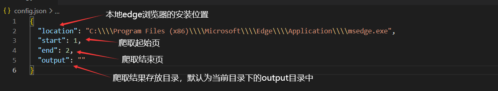
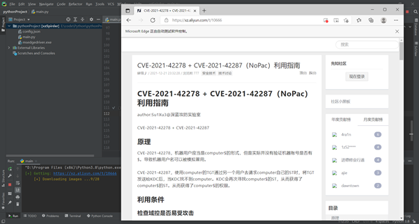
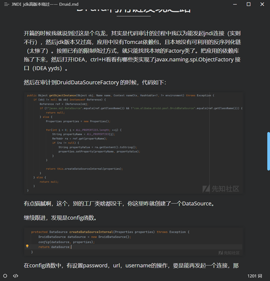

# xzSipder

先知社区爬虫

使用selenium控制edge自动下载指定范围内的文章和其中图片到本地并存为md格式文件。列表格式可能会出现一点小bug，需要手动修复🤡

## 起因

期末python课大作业要求写一个爬虫，本来想直接从GitHub上找一个~~应付~~学习一下，但是没找到合适的，所以决定自己写一个

## 使用方式

`pip install -r requirements.txt`

下载对应版本的msedgedriver驱动到项目根目录

修改config.json

运行main.py

## 运行截图

## fix

修复了无法下载图片的问题